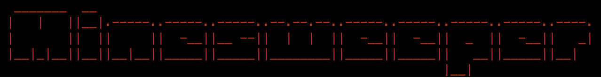

# README für Minesweeper Game
## Über das Spiel:
Minesweeper ist eine klassische Einzelspieler-Puzzlespielanwendung, in der Spieler durch geschicktes Kombinieren von Hinweisen auf versteckte Minen auf einem Rasterfeld stoßen, ohne eine zu detonieren.
## Entwicklungsinformationen:
* Dieses Spiel wird gemäß dem C-89-Standard entwickelt und verwendet ausschließlich [Standardbibliotheken](https://www2.hs-fulda.de/~klingebiel/c-stdlib/index.htm).
* Die Entwicklung orientiert sich an den Beschreibungen und Algorithmen, die in der [Wikipedia](https://de.wikipedia.org/wiki/Minesweeper) für Minesweeper bereitgestellt werden.
* Dieses Projekt dient mir als Übung und Einstieg in die erweiterte Programmierung.
* Dies ist der Anfang des Projekts, weitere Features werden in Zukunft hinzugefügt werden. Möglicherweise werden zukünftige Versionen von C-89-Standard und [Standardbibliotheken](https://www2.hs-fulda.de/~klingebiel/c-stdlib/index.htm) abweichen.
* Die Entwicklung findet auf MacOS statt. Da jedoch nur C-Standardfunktionen verwendet werden, sollte das Spiel auf allen Plattformen kompiliert und fehlerfrei ausgeführt werden können.
## Aktuelle Releases
- [v1.1.0-beta](https://github.com/moritzgladigau/Minesweeper/releases/tag/v1.1-beta) - Jetzt mit Einstellungen speichern und Spielprotokoll!
- [v1.0.0-beta](https://github.com/moritzgladigau/Minesweeper/releases/tag/beta) - Erste stabile Version des Spiels.

## Anleitung zum Kompilieren und Ausführen:
1. Stellen Sie sicher, dass Sie einen C-Compiler installiert haben.
2. Navigieren Sie zum Verzeichnis, in dem sich die Dateien des Spiels befinden.
3. Kompilieren Sie das Spiel mit dem Befehl: **`gcc -o minesweeper *.c`**.
4. Führen Sie das kompilierte Spiel aus, indem Sie **`./minesweeper`** eingeben.
## Spielfunktionen:
* Das Spiel bietet eine klassische Minesweeper-Erfahrung mit einem Rasterfeld, das Minen und Hinweise darauf enthält.
* Der Spieler kann Felder aufdecken und Markierungen setzen, um Minen zu identifizieren.
* Das Spiel endet, wenn der Spieler alle Minen gefunden hat oder auf eine Mine klickt.
## Autoren:
Moritz Gladigau
## Lizenz:
Dieses Projekt ist unter der [MIT License] lizenziert. Weitere Informationen finden Sie in der Datei LICENSE.
